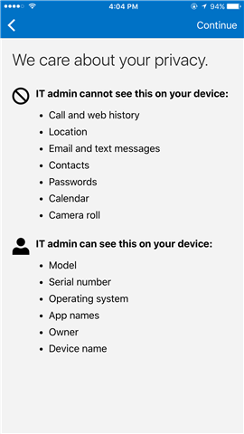
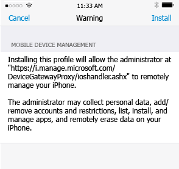
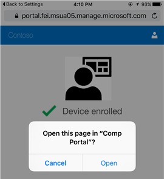

# Inscriba el dispositivo iOS en Intune

Si su empresa o centro educativo usa Microsoft Intune, puede inscribir un dispositivo iOS para obtener acceso al correo electrónico, a los archivos y a otros recursos de la empresa. Cuando los dispositivos se inscriben, el departamento de TI puede administrar esos recursos profesionales o educativos y mantenerlos protegidos, al tiempo que los usuarios pueden usar el dispositivo que elijan libremente para realizar su trabajo. Para obtener más información sobre la inscripción, vea [What happens if you install the Company Portal app and enroll your device in Intune?](what-happens-if-you-install-the-company-portal-app-and-enroll-your-device-in-intune-ios.md) (¿Qué ocurre cuando se instala la aplicación de portal de empresa y se inscribe el dispositivo en Intune?).

<iframe src="https://channel9.msdn.com/Series/IntuneEnrollment/iOS-Enrollment/player" width="960" height="540" allowFullScreen frameBorder="0"></iframe>

> [!NOTE]
> Si lo que intenta inscribir es un dispositivo macOS, por ejemplo, un equipo MacBook Pro o iMac, [siga entonces estas instrucciones](enroll-your-device-in-intune-macos.md).

**Antes de empezar**

- Asegúrese de que termina la inscripción después de iniciar los pasos. Pausar durante unos minutos normalmente detiene el proceso y requerirá reiniciar.
- Si se produce un error en la inscripción por algún motivo, debe volver a la aplicación de Portal de empresa para intentarlo de nuevo.
- Asegúrese de que funciona la red Wi-Fi. De lo contrario, se producirá un error en la inscripción.
- Si bloquea Safari en el dispositivo, debe desbloquearlo. Debe utilizar Safari para realizar la inscripción.

**Para inscribir el dispositivo iOS:**

1.  Siga los pasos de [Install and sign in to the Intune Company Portal app](install-and-sign-in-to-the-intune-company-portal-app-ios.md) (Instalar la aplicación de portal de empresa de Intune e iniciar sesión en ella).

2. En la página **Configuración de acceso a la empresa**, pulse en **Comenzar**.

    

3. En la pantalla **¿Por qué inscribir el dispositivo?**, lea lo que puede hacer si inscribe el dispositivo y, luego, pulse en **Continuar**.

    

> [!NOTE]
> Los triángulos amarillos no significan que ya haya un error. Estos iconos indican que todavía hay pasos del proceso de inscripción que deben completarse.

4. Revise una lista sobre lo que el administrador de TI puede y no puede ver en el dispositivo inscrito y después pulse **Continuar**.

    

5.  En la pantalla **¿Qué ocurre después?**, lea lo que ocurre durante la inscripción y, luego, pulse en **Inscribir**.

    

6.  En la pantalla **Instalar perfil**, pulse **Instalar** y escriba su contraseña, si se le pide.

    

7.  Pulse **Instalar**.

        

8.  Pulse **Instalar** para indicar que ha leído la advertencia.

    

9.  Pulse **Confiar**.

    

10.  Cuando la pantalla cambie para indicar que el perfil ha terminado de instalarse, pulse en **Listo**.

    

    Aparece el mensaje "Inscribiendo el dispositivo" en pantalla.

11.  Cuando se muestre un mensaje en el que se le pregunte si quiere abrir la página en el Portal de empresa, pulse **Abrir**.

    

12. En la pantalla **Configuración de acceso a la empresa**, pulse **Continuar**. Si el administrador de TI ha configurado más requisitos de seguridad (como establecer obligatoriamente una contraseña), siga las instrucciones en pantalla hasta satisfacer todos los requisitos de cumplimiento. Tras ello, regresará a la pantalla Configuración de acceso a la empresa, donde deberá pulsar en **Continuar**.

    

13. Pulse **Listo**.

    

El dispositivo ya está inscrito en Intune. Se le dirigirá de nuevo a la aplicación de portal de empresa.

> [!Note]
> Si su organización usa software de administración de gastos de telecomunicaciones, deberá completar algunos pasos adicionales antes de que el dispositivo esté completamente inscrito. Descubra más [aquí](enroll-your-device-with-telecom-expense-management-ios.md).

¿Sigue necesitando ayuda? Póngase en contacto con el administrador de TI. Para averiguar su información de contacto, vaya al [sitio web del portal de empresa](http://portal.manage.microsoft.com).
