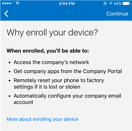

# Inscriba el dispositivo iOS en Intune

Si su empresa o centro educativo usa Microsoft Intune, puede inscribir un dispositivo iOS para obtener acceso al correo electrónico, a los archivos y a otros recursos de la empresa. Cuando los dispositivos se inscriben, el departamento de TI puede administrar esos recursos profesionales o educativos y mantenerlos protegidos, al tiempo que los usuarios pueden usar el dispositivo que elijan libremente para realizar su trabajo. Para obtener más información sobre la inscripción, vea [What happens if you install the Company Portal app and enroll your device in Intune?](what-happens-if-you-install-the-company-portal-app-and-enroll-your-device-in-intune-ios.md) (¿Qué ocurre cuando se instala la aplicación de portal de empresa y se inscribe el dispositivo en Intune?).

> [!VIDEO https://channel9.msdn.com/Series/IntuneEnrollment/iOS-Enrollment/player]

> [!NOTE]
> Si está tratando de acceder al correo electrónico de la empresa en la aplicación Mail, es probable que se le haya solicitado permiso para administrar su dispositivo por motivos de seguridad. Siga estas instrucciones para acceder a su correo electrónico y a otros recursos de la empresa en su dispositivo iOS.

**Antes de empezar**

- Asegúrese de que termina la inscripción después de iniciar los pasos. Hacer una pausa durante unos minutos suele detener el proceso, por lo que deberá reiniciarla.
- Si por algún motivo se produce un error en la inscripción, deberá volver a la aplicación Portal de empresa para intentarlo de nuevo.
- Asegúrese de que funciona la red Wi-Fi. De lo contrario, se producirá un error en la inscripción.
- Si bloquea Safari en el dispositivo, debe desbloquearlo. Safari se usa como parte del proceso de inscripción de dispositivos.

**Para inscribir el dispositivo iOS:**

1.  Siga los pasos de [Install and sign in to the Intune Company Portal app](install-and-sign-in-to-the-intune-company-portal-app-ios.md) (Instalar la aplicación de portal de empresa de Intune e iniciar sesión en ella).

2. En la página **Configuración de acceso a la empresa**, pulse en **Comenzar**.

    

3. En la pantalla **¿Por qué inscribir el dispositivo?**, lea lo que puede hacer si inscribe el dispositivo y, luego, pulse en **Continuar**.

    

  > [!NOTE]
  > Los triángulos amarillos no significan que ya haya un error. Estos iconos indican que todavía hay pasos del proceso de inscripción que deben completarse.

4. Revise una lista sobre lo que el equipo de soporte técnico de su empresa puede y no puede ver en el dispositivo inscrito y después pulse **Continuar**.

    

5.  En la pantalla **¿Qué ocurre después?**, lea lo que ocurre durante la inscripción y, luego, pulse en **Inscribir**.

    

6.  En la pantalla **Instalar perfil**, pulse **Instalar** y escriba su contraseña, si se le pide.

    

7.  Pulse **Instalar**.

        

8.  Pulse **Instalar** para indicar que ha leído la advertencia.

    

9.  Pulse **Confiar**.

    

10.  Cuando la pantalla cambie para indicar que el perfil ha terminado de instalarse, pulse en **Listo**.

    

    Aparece el mensaje "Inscribiendo el dispositivo" en pantalla.

11.  Cuando se muestre un mensaje en el que se le pregunte si quiere abrir la página en el Portal de empresa, pulse **Abrir**.

    

12. En la pantalla **Configuración de acceso a la empresa**, pulse **Continuar**. En esta pantalla se muestran los demás requisitos que debería cumplir para que el dispositivo sea compatible (como establecer una contraseña). Siga las instrucciones que aparecen en pantalla hasta que cumpla todos los requisitos de cumplimiento. Cuando haya terminado, volverá a la pantalla Configuración de acceso a la empresa. Pulse **Continuar**.

    

13. Pulse **Listo**.

    

El dispositivo ya está inscrito en Intune. Se le dirigirá de nuevo a la aplicación de portal de empresa.

> [!Note]
> Debe seguir unos pocos pasos más para que el dispositivo esté totalmente inscrito. Obtenga más información sobre cómo [inscribir el dispositivo mediante la administración de gastos de telecomunicaciones](enroll-your-device-with-telecom-expense-management-ios.md). Si su organización usa el Programa de inscripción de dispositivos de Apple, obtenga más información [aquí](enroll-your-device-dep-ios.md).

¿Sigue necesitando ayuda? Póngase en contacto con el departamento de soporte técnico de la empresa. Para averiguar su información de contacto, vaya al [sitio web del portal de empresa](https://portal.manage.microsoft.com).
