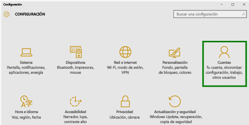
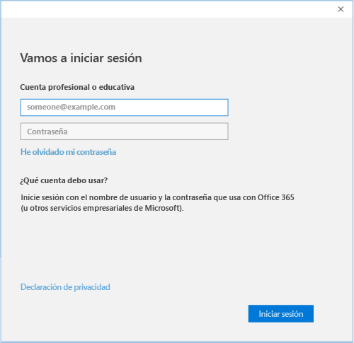

# Inscribir un dispositivo Windows 10 en Intune

  > [!NOTE]
  > Windows 10 funciona en dispositivos de todo tipo. Tanto si usa un dispositivo de escritorio como un teléfono o una tableta, los pasos que debe seguir son los mismos, aunque puede que presenten pequeñas diferencias respecto a las imágenes que se muestran en esta página.

1.  Vaya a **Inicio**.

  - Si está usando un dispositivo con **una versión de escritorio de Windows 10**, vaya al **menú Inicio**.
  - Si está usando un dispositivo con **Windows 10 Mobile**, vaya al **menú Inicio** y, después, deslice el dedo para ir a la lista **Todas las aplicaciones**.

2. Abra la aplicación **Configuración** de Windows buscando "configuración" en la barra de búsqueda.

3. Seleccione **Cuentas**.

    

4. Seleccione **Su cuenta**.

    

5. Seleccione **Agregar una cuenta profesional o educativa**.

    

6. Inicie sesión con las credenciales de su trabajo o escuela.

    

¿Sigue sin poder acceder a su correo electrónico, archivos u otros datos profesionales o educativos? Para corregirlo, [solucione los problemas relacionados con su cuenta](troubleshoot-your-windows-10-device-windows.md#troubleshooting-steps-to-follow-if-you-see-your-account). Si sigue sin tener acceso, deberá ponerse en contacto con el administrador de TI para obtener más ayuda.

Puede obtener ayuda del administrador de TI fácilmente a través de la información de contacto incluida en la aplicación de portal de empresa. Esta aplicación también le permite buscar y descargar otras aplicaciones recomendadas y necesarias para el trabajo diario. Es posible que ya tenga la aplicación de portal de empresa instalada en el dispositivo. Una manera sencilla de comprobarlo consiste en buscar __Portal de empresa__ en la lista __Todas las aplicaciones__.

Si no ve el Portal de empresa en su lista de aplicaciones, siga estos pasos para instalarlo.

1. Seleccione **Iniciar** > **Tienda**.

2. Seleccione **Buscar** y luego escriba **portal de empresa**.

3. En la lista de resultados, seleccione **Portal de empresa** > **Instalar**.

4. Seleccione **Instalar** o **Gratis**. No hay ninguna diferencia entre estas dos opciones. La opción que se muestra depende de la manera en que su organización configuró la aplicación de portal de empresa.

