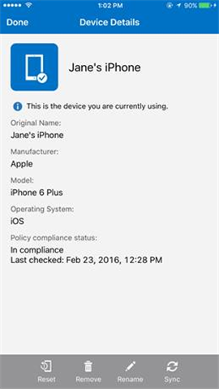

# Sincronización manual del dispositivo iOS

A veces, una aplicación puede tardar más tiempo en descargarse desde el Portal de empresa. Si esto sucede, puede intentar sincronizar manualmente su dispositivo. Esto significa que se está indicando al dispositivo que vuelva a intentar obtener la información que puede tener dificultades para descargarse.

1. Abra la aplicación del portal de empresa.

2. En la sección **Mis dispositivos**, elija el dispositivo que está usando actualmente. Es el icono de dispositivo más a la izquierda. También tiene una marca de verificación en ella.

    

3. Pulse el botón **Sincronizar** en la parte inferior derecha de la pantalla.

    

Aparecerá una barra de carga en la pantalla y se cargará hasta que finalice la sincronización.

¿Sigue necesitando ayuda? Póngase en contacto con el administrador de TI. Para averiguar su información de contacto, vaya al [sitio web del portal de empresa](http://portal.manage.microsoft.com).

