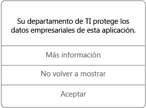

# Usar aplicaciones administradas en el dispositivo Android

Las aplicaciones administradas son aplicaciones que el equipo de soporte técnico de su empresa puede configurar para ayudar a proteger los datos de la empresa a los que se puede obtener acceso en esa aplicación. Al acceder a los datos de la empresa en una aplicación administrada en el dispositivo Android, es posible que observe que la aplicación funciona de forma un poco diferente a la esperada. Por ejemplo, es posible que no pueda copiar y pegar los datos protegidos de la compañía o no pueda guardar dichos datos en determinadas ubicaciones.

Las distintas aplicaciones administradas también pueden trabajar juntas en el dispositivo para que pueda realizar las tareas diarias, a la vez que mantiene los datos corporativos protegidos. Por ejemplo, si abre un archivo de la empresa en una aplicación administrada y se requiere otra aplicación administrada para ver ese archivo, la aplicación administrada que le permite ver el archivo se abre automáticamente. Si una aplicación requerida no está disponible, ciertas operaciones, como la apertura de un documento o el acceso a un vínculo web desde dentro de un documento administrado, pueden no estar disponibles.

Cuando accede a datos de la empresa en una aplicación administrada, verá un mensaje como el siguiente, que le permite saber que la aplicación que está abriendo está administrada.

## ¿Cómo se pueden obtener aplicaciones administradas?
Las aplicaciones administradas se obtienen de dos maneras distintas:

-   Cuando el dispositivo está inscrito en Microsoft Intune, puede instalar la aplicación desde la aplicación Portal de empresa o un sitio web del Portal de empresa, o bien el equipo de soporte técnico de su empresa puede instalarla en el dispositivo. Para más información sobre la inscripción, vea [Inscripción del dispositivo en Intune](enroll-your-device-in-Intune-android.md).

-   Instale una aplicación desde Play Store y después inicie sesión con su cuenta de usuario corporativo administrada por Intune.

## ¿Qué puede administrar el equipo de soporte técnico de mi empresa en una aplicación?
Estos son algunos ejemplos de opciones que el equipo de soporte técnico de su empresa puede administrar en una aplicación y que pueden afectar a las interacciones con los datos de la empresa en el dispositivo:

-   Acceso a sitios Web específicos

-   Transferencias de datos entre las aplicaciones

-   Almacenamiento de archivos

-   Operaciones de copiado y pegado

-   Requisitos de acceso PIN

-   El inicio de sesión con credenciales corporativas

-   La capacidad de realizar una copia de seguridad en la nube

-   La capacidad de realizar capturas de pantalla

-   Requisitos de cifrado de datos

Estas son algunas de las aplicaciones comunes que puede administrar el departamento de TI:

-   Intune Managed Browser

-   Visor de imágenes de Intune

-   Visor de PDF de Intune

-   Reproductor de AV de Intune

-   Microsoft Word, Excel y PowerPoint

Para más información sobre las aplicaciones administradas en el dispositivo, póngase en contacto con el equipo de soporte técnico de su empresa. Para averiguar su información de contacto, vaya al [sitio web del portal de empresa](https://portal.manage.microsoft.com#HelpDeskDialog).
